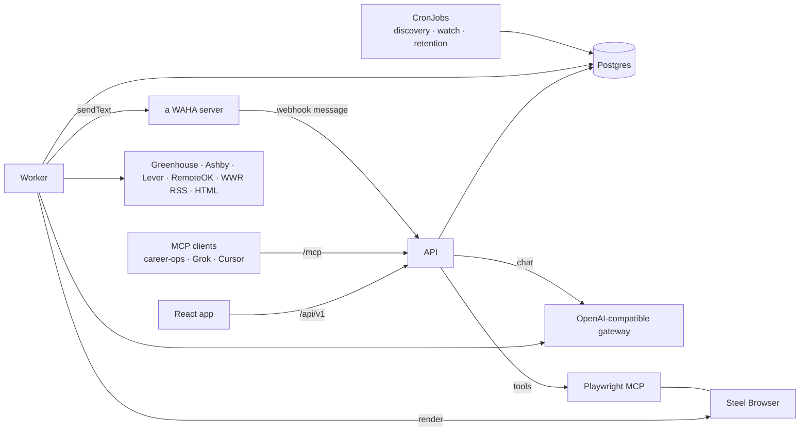
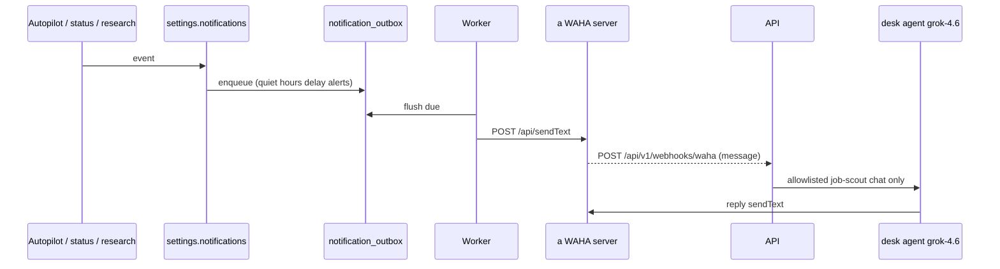

# Architecture

## Processes

| process | entry | role |
|--|--|--|
| **api** | `apps/api/src/index.ts` | Hono REST under `/api/v1`, MCP under `/mcp`, static web bundle in prod. Runs drizzle migrations on boot. Runs the chat agent loop (SSE). `EMBED_WORKER=1` also starts the worker in-process (dev). |
| **worker** | `apps/worker/src/index.ts` | Claims `jobs` rows (`FOR UPDATE SKIP LOCKED`), runs them with bounded concurrency, retries transient LLM/network failures, parks jobs that hit a cap for an hour, requeues stale `running` rows every 15 min and releases in-flight jobs on SIGTERM. Flushes WhatsApp `notification_outbox` (~4s). Inbound chat is a WAHA webhook into the API. In-process scheduler (`WORKER_SCHEDULER=1`) enqueues discovery/watch/retention on timers; in Kubernetes that is off and CronJobs do it. |
| **once** | `apps/worker/src/once.ts <task>` | One-shot `discovery` / `watch` / `retention` for CronJobs. |

Both api and worker import `@job-scout/core`; there is no HTTP between them, the database is the queue and the contract. Both serve Prometheus metrics on `:9464/metrics` and log JSON to stdout; the api additionally reports DB-truth gauges (queue depth, funnel, inbox). See [OBSERVABILITY](./OBSERVABILITY.md).

## Job types

| type | enqueued by | does |
|--|--|--|
| `board_scan` | discovery scheduler, Radar, MCP | fetch a board, diff against the last snapshot, run the gate, upsert positions, enqueue `triage` |
| `scan_url` | Add URL, MCP `intake` | fetch one JD, create/refresh the position, enqueue `triage` |
| `watch_check` | watch scheduler, Position › refresh | re-fetch a JD, write a `jd_revisions` row if it changed, detect closed listings |
| `triage` | gate pass, autopilot | cheap 1–5 score + hard disqualifiers; sets `triage_*` on the position |
| `evaluate` | you, autopilot | A–H markdown report + summary JSON → `evaluations` |
| `company_research` | you, autopilot | company dossier → `evaluations(kind=company_research)` |
| `jd_review` | material JD change, you | what changed and whether it matters → `evaluations(kind=jd_review)` |
| `materials` | you, autopilot | tailored resume + cover → `application_materials` |
| `retention` | scheduler / CronJob | prune snapshots, jobs, discovery rows, deltas, LLM runs per Settings › System |

## Packages

| path | role |
|--|--|
| `packages/shared` | pure code: gate, settings schema + defaults, notify routing/allowlist/quiet hours, classify (craft/geo/remote), salary parsing, hashing, types, the JSON logger (`log.ts`) |
| `packages/db` | drizzle schema, migrations, client (Postgres via `pg`, or PGlite when `DATABASE_URL` is unset); includes `notification_outbox` |
| `packages/ats` | URL detection and fetchers; `fetchJobFromUrl(url, { render })` accepts a renderer for JS-only pages |
| `packages/llm` | OpenAI-compatible client: `chatJson` (json_schema with lenient fallback), `chatDocument` (markdown + trailing JSON), `chatStream` (tool calls); prompts as code; the scout brief |
| `packages/core` | everything with a database: positions, companies, scan/watch, triage/evaluate/materials, autopilot hooks, approvals, chat agent, WAHA sender + notify outbox + WhatsApp inbox, browser client, settings, retention, radar; `metrics.ts` is the Prometheus registry every module increments |
| `apps/api` | routes by resource, auth, envelope, MCP server |
| `apps/worker` | job dispatch, retries, scheduler |
| `apps/web` | React 19, TanStack Router/Query, Tailwind 4; `ui/kit.tsx` primitives, `frame/` shell, `pages/` |

## Where things live

| owner | data |
|--|--|
| **Postgres** | positions, JD revisions, evaluations, materials, timeline, boards/snapshots/deltas, discovery feed, jobs, LLM runs, settings, approvals, chat threads, notification outbox |
| **Settings row** | one JSON document (`settings` table) validated by `packages/shared/src/settings.ts`: gate, triage thresholds, per-operation models, autopilot policy, chat permissions, WhatsApp notifications, retention, scan cadence |
| **WhatsApp** | a WAHA server session `default`. ConfigMap `WAHA_BASE_URL`/`WAHA_SESSION`; Secret `job-scout-waha` (`WAHA_API_KEY`, `WAHA_WEBHOOK_KEY`). Outbound = worker `sendText` flush of `notification_outbox`. Inbound = ClusterIP webhook `POST /api/v1/webhooks/waha` (`message` only; `message.any` is ignored). GOWS GET `/messages` is fromMe-only so poll cannot see allowlisted senders. Groups: desk / new / process / research / chat. **an engineering-only room** is engineering-only |
| **career-ops** (separate repo) | its own markdown tracker and reports; linked to positions through `positions.metadata.careerOps` |
| **Browser plane** | dedicated GitOps app (`platform-gitops/apps/browser-job-scout`): job-scout Steel + Playwright MCP sidecar. Shared human Chrome is `apps/browser`. job-scout only holds its URLs in env |

## Auth

- **Session** — `POST /api/v1/auth/login` with `AUTH_PASSWORD` (or the token seed) sets a cookie. `AUTH_MODE=dev` skips it.
- **Bearer** — `API_TOKEN_SEED` is an always-valid admin token; further tokens are minted under Settings › System and stored hashed in `api_tokens` with scopes (`agent`, `mcp`, `admin`).
- **`AUTH_MODE=cf_access`** — trusts the Cloudflare Access email header.

MCP uses the same Bearer tokens.

## WhatsApp path

Policy: `packages/shared/src/notify.ts`. Sender: `packages/core/src/waha.ts`. Outbox: `packages/core/src/notify.ts` (`flushNotify` claims a pending row via `provider_ref` before `sendText` so the API and worker cannot double-send). Inbox: `packages/core/src/whatsapp-inbox.ts` (`handleWahaWebhookEvent`). The session already has a another app webhook; job-scout **appends** a second webhook and does not replace the list.

## Failure behaviour

- LLM gate errors (operation disabled, no model, cap or budget reached) are not job failures: the job is parked and retried in an hour.
- Transient LLM/network errors retry up to 3 attempts with linear backoff.
- Postgres pool errors are logged, not fatal; the client reconnects.
- A worker killed mid-job leaves the row `running`; the next worker requeues it after 30 min, and a graceful shutdown releases it immediately.
